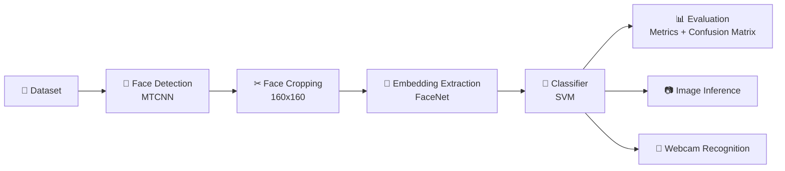

# 🚀 Real-Time Face Recognition System


A **modular real-time face recognition system** built using **MTCNN**, **FaceNet**, and **Support Vector Machines (SVM)**.

This project demonstrates how a **machine learning prototype notebook can be converted into a clean production-style ML pipeline** with modular architecture, training pipeline, evaluation reports, and real-time inference.

---

# 📸 Pipelie


```text
Webcam → Face Detection → Face Embedding → Identity Prediction
```

Example output:

```
Aditya (0.97)
Unknown (0.41)
```

---

# 🧠 System Architecture

The system follows a **modular machine learning architecture** where each stage is separated into reusable components.



This architecture separates the system into **data → embeddings → model → inference → analytics** stages.

---

# ⚙️ Machine Learning Pipeline

The ML pipeline implemented in this project follows these stages:

```text
Dataset
   ↓
Face Detection (MTCNN)
   ↓
Face Cropping & Preprocessing
   ↓
Embedding Extraction (FaceNet)
   ↓
Classifier Training (SVM)
   ↓
Evaluation
   ↓
Real-Time Inference
```

Each stage is implemented as a **separate Python module** for maintainability.

---

# 📂 Project Structure

```text
face-recognition-system/

app/                # Application entry points
src/                # Core ML pipeline
models/             # Saved trained models
reports/            # Evaluation outputs
notebooks/          # Experimental notebooks

data/               # Dataset directory

main.py             # CLI interface
requirements.txt    # Dependencies
README.md           # Documentation
```

### Core Modules

```
src/
 ├── data_loader.py     # dataset loading
 ├── detector.py        # face detection
 ├── embedder.py        # FaceNet embeddings
 ├── trainer.py         # SVM training pipeline
 ├── evaluator.py       # metrics & confusion matrix
 └── infer.py           # inference utilities
```

---

# 🛠 Installation

Create a virtual environment and install dependencies.

```bash
python -m venv .venv

# Windows
.venv\Scripts\activate

# Linux / macOS
source .venv/bin/activate

pip install -r requirements.txt
```

---

# 🗂 Dataset Format

The dataset should be organized into **identity-based folders**.

```text
data/raw/

person_1/
   img1.jpg
   img2.jpg

person_2/
   img1.jpg
   img2.jpg
```

Each folder name acts as the **label for that person**.

---

# 🧠 Training the Model

Run the training pipeline:

```bash
python main.py train
```

This step performs:

✔ Face detection  
✔ Embedding generation  
✔ SVM model training  
✔ Evaluation  
✔ Artifact saving

Generated artifacts:

```text
models/
 ├── svm_model.pkl
 └── label_encoder.pkl

reports/
 ├── metrics.json
 └── confusion_matrix.png
```

---

# 🖼 Image Inference

Run recognition on a single image.

```bash
python main.py infer-image --image path/to/image.jpg
```

Optional output image:

```bash
python main.py infer-image \
  --image path/to/image.jpg \
  --save reports/output.jpg
```

---

# 🎥 Real-Time Webcam Recognition

Run live recognition using webcam.

```bash
python main.py webcam
```

Options:

```
--camera       camera index
--frame-skip   skip frames for faster inference
```

Press **Q** to exit.

---

# 📊 Evaluation Metrics

The training pipeline exports:

📈 Accuracy  
📈 Precision (weighted)  
📈 Recall (weighted)  
📈 F1 Score (weighted)

It also generates a **confusion matrix visualization**.

---

# 💡 Key Design Decisions

### 🔹 Modular Architecture

The project separates the ML system into independent components:

• detection  
• embedding extraction  
• training  
• inference

This makes the system easier to **debug, extend, and maintain**.

### 🔹 Pretrained Deep Embeddings

Using **FaceNet embeddings** allows the system to leverage deep feature representations without training a CNN from scratch.

### 🔹 Lightweight Classifier

An **SVM classifier** works well with embedding vectors and smaller datasets.

---

# 🚀 Future Improvements

Planned improvements include:

• 🔄 Face alignment before embedding extraction  
• 🧭 Multi-object tracking for stable webcam predictions  
• ⚡ Embedding caching for faster retraining  
• 🎛 Hyperparameter tuning for SVM

---

# 🧩 Possible Applications

• 🏢 Smart access control systems
• 🧑‍💼 Attendance tracking
• 🔐 Identity verification
• 🎥 Smart surveillance

---

# 👨‍💻 Author

**Aditya Prakash**  
Indian Institute of Technology Patna

---

# 📜 License

MIT License

